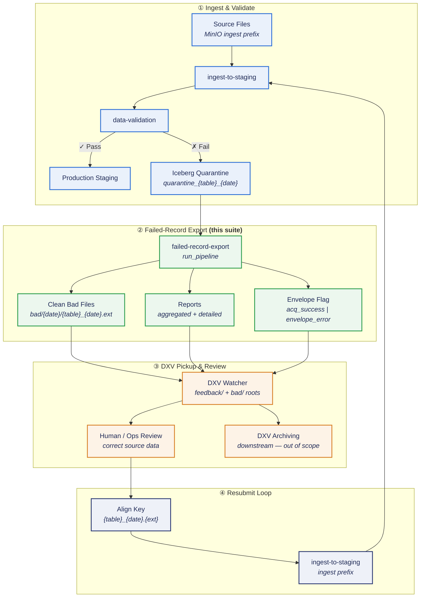
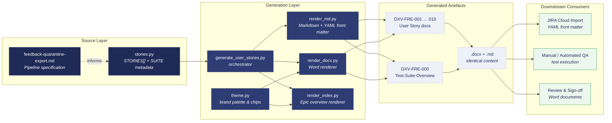

# DXV — Data Exchange Vault · Integration Test Suite

**Module:** AML Data Ingestion · Feedback (Quarantine Export)  
**Pipeline under test:** `failed-record-export`  
**Epic:** `DXV-FRE` · Version 1.0

---

This repository holds a structured integration test suite for the **failed-record-export** stage of the AML (Anti-Money Laundering) data platform. That stage reads rows that failed upstream validation from Apache Iceberg quarantine tables, writes delimiter-separated export files and acquisition envelope flags to MinIO, and enables the **DXV (Data Exchange Vault)** pickup service to close the failure feedback loop—so corrected records can flow back into ingestion without manual renaming or ad hoc file handling.

The suite comprises **10 user stories**, **62 test cases**, and **175 executable test steps**, each documented as richly formatted Word (`.docx`) and JIRA-ready Markdown (`.md`) artefacts. A Python generator keeps both formats synchronised from a single source of truth.

---

## Table of Contents

1. [What This Project Does](#1-what-this-project-does)
2. [The Pipeline Under Test](#2-the-pipeline-under-test)
3. [End-to-End Failure Feedback Loop](#3-end-to-end-failure-feedback-loop)
4. [Repository Architecture](#4-repository-architecture)
5. [Test Suite Structure](#5-test-suite-structure)
6. [Getting Started](#6-getting-started)
7. [How to Execute Tests](#7-how-to-execute-tests)
8. [Configuration & Environment](#8-configuration--environment)
9. [Output Layout Reference](#9-output-layout-reference)
10. [Scope Boundaries](#10-scope-boundaries)
11. [Document Index](#11-document-index)

---

## 1. What This Project Does

Modern AML ingestion pipelines validate incoming customer and transaction data against a data contract. Rows that fail validation are isolated in **quarantine Iceberg tables** rather than polluting production staging. Operations teams need a reliable, automated way to extract those failures, review them, fix source data, and **resubmit** corrected files—without breaking naming conventions that downstream systems expect.

The **failed-record-export** pipeline stage solves the export side of that problem. For each run date (`process_date` in `YYYYMMDD` format), it:

- Reads quarantine tables for every logical table listed in the AML data contract.
- Produces three classes of data export: a **clean bad** file (validation metadata stripped, ready for resubmit), an **aggregated** summary (counts by error type and field), and a **detailed** export (full rows with validation errors as JSON).
- Emits a single **envelope flag** per run—either `acq_success_{date}.zip.flag` when no failures were exported, or `envelope_error_{date}.zip.flag` when any table had quarantined rows.
- Writes all objects under normalised MinIO paths that **DXV** is configured to watch, using the same flow-wide bucket and credentials as ingest and validation stages.

**This repository does not implement that pipeline.** It defines, documents, and traceably decomposes the integration behaviour into Agile user stories and executable test cases. Test engineers, QA automation agents, and JIRA importers use the generated documents to verify that the live `failed-record-export` stage behaves exactly as specified in `feedback-quarantine-export.md`.

The documentation generator (`generate_user_stories.py`) reads a structured catalogue in `stories.py` and renders:

| Output | Purpose |
| --- | --- |
| `DXV-FRE-000_Test-Suite-Overview.{md,docx}` | Epic-level summary, scope, environment, traceability matrix |
| `DXV-FRE-00N_*.{md,docx}` (N = 1–10) | Individual user stories with acceptance criteria and test cases |

Markdown files include YAML front matter (`jira_issue_type`, `story_key`, `test_case_count`, etc.) for automated import into Atlassian JIRA Cloud.

---

## 2. The Pipeline Under Test

The failed-record-export stage is invoked through the shared AML pipeline runner, identical in pattern to ingest, validation, and other MinIO-driven stages:

```python
import os
from pipeline import run_pipeline

result = run_pipeline(
    "failed-record-export",
    minio_config_path=os.getenv("minio_config_path"),  # bucket-relative contract JSON
    process_date=os.getenv("process_date"),            # YYYYMMDD
    # Optional overrides (kwargs beat spec JSON beat defaults):
    # bad_records_location="landing/acquisition/bad",
    # feedback_location="landing/acquisition/feedback",
    # report_location="landing/acquisition/feedback/reporting",
    # file_format="csv", separator=",", include_header=True,
)
```

**Required inputs**

| Input | Description |
| --- | --- |
| `minio_config_path` | Bucket-relative path to the AML data contract JSON (distinct from json-transformation config paths). |
| `process_date` | Run date in `YYYYMMDD`; merged into the parsed spec and used for quarantine table names and output paths. |

**Configuration precedence** (highest wins): `run_pipeline` keyword arguments → optional fields in the contract JSON → built-in defaults.

**Quarantine source naming:** `{CATALOG}.{WORKSPACE_ID}.quarantine_{table_name}_{process_date}` — workspace and catalog come from environment variables. If a quarantine table does not exist for a contract table on the given date, that table is **skipped** (not a hard failure for the whole export).

**Return value:** A Python `dict` summarising the run (tables processed/skipped, objects written, flag type emitted)—usable by orchestrators and covered explicitly in story DXV-FRE-009.

---

## 3. End-to-End Failure Feedback Loop

The diagram below shows how failed-record-export sits in the wider AML flow and how DXV closes the round-trip back to ingestion.



**Key integration contracts validated by this suite:**

- **Shared MinIO:** Export uses the same flow-wide bucket and credentials as ingest/validation—no separate credential set.
- **DXV watch roots:** Defaults are `landing/acquisition/feedback/` and `landing/acquisition/bad/` (with optional `{ORG_UNIT}/` prefix).
- **Resubmit key alignment:** `ingest-to-staging` resolves `{table_name}_{process_date}.{input.extension}` under the ingest prefix. Clean-bad export keys must match, or operators must rename objects or adjust `process_date` / contract settings.
- **Archiving:** Performed on the DXV side after pickup—not by failed-record-export.

---

## 4. Repository Architecture

The repository follows a **single-source-of-truth** pattern: all user story content lives in `stories.py`; renderers produce parallel Word and Markdown outputs so content never drifts.



### File roles

| File | Role |
| --- | --- |
| `feedback-quarantine-export.md` | Authoritative pipeline behaviour reference (inputs, paths, flags, formats). |
| `stories.py` | Structured catalogue: `SUITE` metadata + `STORIES[]` with acceptance criteria and test cases. |
| `generate_user_stories.py` | Entry point—iterates stories and writes all `.docx` and `.md` files plus the overview. |
| `render_docx.py` | Builds styled Word documents (tables, callouts, priority chips, traceability formatting). |
| `render_md.py` | Builds JIRA-ready Markdown with YAML front matter. |
| `render_index.py` | Renders the epic-level overview document (DXV-FRE-000). |
| `theme.py` | Shared visual theme (indigo/slate enterprise palette) for consistent styling. |

To regenerate all documents after editing `stories.py`:

```bash
python generate_user_stories.py
```

**Dependency:** [python-docx](https://python-docx.readthedocs.io/) (`pip install python-docx`).

---

## 5. Test Suite Structure

Ten user stories partition the failed-record-export behaviour into discrete, testable functional and non-functional areas. The diagram groups them by epic theme and shows test-case coverage.

```mermaid
flowchart TB
    EPIC(["<b>DXV-FRE Epic</b><br/>62 Test Cases · 175 Steps"])

    EPIC --> ORCH["Pipeline Orchestration<br/>& Configuration"]
    EPIC --> ACQ["Quarantine Source<br/>Acquisition"]
    EPIC --> LAYOUT["Output Layout<br/>& Object Keys"]
    EPIC --> CONTENT["Data Export<br/>Content"]
    EPIC --> FLAGS["Feedback Flags<br/>& Envelope Semantics"]
    EPIC --> FORMAT["Writer Format<br/>& Delimiters"]
    EPIC --> RF["RFFilespec /<br/>Headerless Compatibility"]
    EPIC --> STORAGE["Object-Store Behaviour<br/>& Naming"]
    EPIC --> INTEG["Downstream Integration<br/>& Round-Trip"]
    EPIC --> NFR["Non-Functional<br/>Quality"]

    ORCH --- S001["DXV-FRE-001<br/>7 TCs · Highest"]
    ACQ --- S002["DXV-FRE-002<br/>6 TCs · Highest"]
    LAYOUT --- S003["DXV-FRE-003<br/>5 TCs · High"]
    CONTENT --- S004["DXV-FRE-004<br/>6 TCs · Highest"]
    FLAGS --- S005["DXV-FRE-005<br/>6 TCs · Highest"]
    FORMAT --- S006["DXV-FRE-006<br/>8 TCs · High"]
    RF --- S007["DXV-FRE-007<br/>4 TCs · Medium"]
    STORAGE --- S008["DXV-FRE-008<br/>6 TCs · High"]
    INTEG --- S009["DXV-FRE-009<br/>6 TCs · High"]
    NFR --- S010["DXV-FRE-010<br/>8 TCs · High"]

    classDef epic fill:#1F2A56,stroke:#2E3C74,stroke-width:3px,color:#FFFFFF
    classDef theme fill:#2E3C74,stroke:#3C4A66,color:#FFFFFF
    classDef story fill:#EEF1F8,stroke:#C9D0E0,color:#1F2A56

    class EPIC epic
    class ORCH,ACQ,LAYOUT,CONTENT,FLAGS,FORMAT,RF,STORAGE,INTEG,NFR theme
    class S001,S002,S003,S004,S005,S006,S007,S008,S009,S010 story
```



### Test type coverage

Each story contains ordered test cases tagged by type:

| Type | Purpose |
| --- | --- |
| **Happy Path** | Baseline behaviour under normal conditions. |
| **Negative** | Invalid inputs, missing prerequisites, key mismatches. |
| **Boundary** | Edge values (dates, empty quarantine, format limits). |
| **Security** | Credential handling, path traversal, access boundaries. |
| **Non-Functional** | Performance, reliability, compatibility thresholds. |

Execute test cases **in document order** within each story: happy-path cases establish baseline behaviour before edge and failure scenarios.

---

## 6. Getting Started

### Prerequisites

- Python 3.9+
- `python-docx` for document generation
- Access to a test environment with:
  - MinIO (flow-wide bucket + credentials)
  - Apache Iceberg catalog with quarantine tables
  - The AML `pipeline` package with `run_pipeline`
  - Optional: DXV pickup watcher (or stub) for integration stories

### Clone and generate documents

```bash
git clone <repository-url>
cd DXV
pip install python-docx
python generate_user_stories.py
```

Expected output: 22 files (10 stories × 2 formats + overview × 2 formats).

### Review the suite

Start with [`DXV-FRE-000_Test-Suite-Overview.md`](DXV-FRE-000_Test-Suite-Overview.md) for scope, environment settings, and the full traceability matrix linking every story to its document file.

---

## 7. How to Execute Tests

This repository delivers **test specifications**, not automated test runners. Execution is manual or via your organisation's QA automation framework.

**Recommended workflow:**

1. **Select a story** from the traceability matrix (e.g. DXV-FRE-004 for data file content).
2. **Verify global preconditions** listed at the top of the story (MinIO reachable, contract JSON present, quarantine populated or intentionally empty).
3. **Run test cases in order**—each case has numbered steps with Action, Test Data, and Expected Result columns.
4. **Substitute environment-specific values** for example placeholders (`process_date=20260313`, table `customer`, paths under `landing/acquisition/...`).
5. **Record pass/fail** against expected results; negative cases should confirm the system fails safely (no silent loads, no orphan objects).
6. **For round-trip stories (DXV-FRE-009)**, confirm clean-bad keys align with `ingest-to-staging` expectations before declaring success.

For JIRA import, use the Markdown files—the YAML front matter carries `story_key`, `test_case_count`, `test_type_breakdown`, and related fields.

---

## 8. Configuration & Environment

| Aspect | Setting |
| --- | --- |
| **Object store** | MinIO — flow-wide bucket + credentials (shared with ingest/validation) |
| **Table format** | Apache Iceberg quarantine tables |
| **Runner** | `pipeline.run_pipeline("failed-record-export", ...)` |
| **Key env vars** | `ORG_UNIT` (optional path prefix), `WORKSPACE_ID`, `CATALOG` |
| **Process date** | `process_date` in `YYYYMMDD` — required on every run |

### Configuration precedence

```
run_pipeline kwargs  →  contract JSON optional fields  →  built-in defaults
```

Optional kwargs / spec fields: `bad_records_location`, `feedback_location`, `report_location`, `file_format`, `separator`, `include_header`.

### Export format notes

| `file_format` | Delimiter behaviour |
| --- | --- |
| `csv` | Comma default; override with `separator` |
| `txt` | Tab default if no separator set |
| `pipe` | Pipe-separated; object key uses `.pipe` extension |
| `gs` | Group separator; fixed delimiter in writer |

Ingest accepts only `.csv` and `.txt` keys. For pipe-separated content with a `.csv` key, use `file_format="csv"` with `separator="|"`. When `input.use_rffilespec` is true, set `include_header=false` for headerless alignment.

---

## 9. Output Layout Reference

When `ORG_UNIT` is set, all paths are prefixed with `{ORG_UNIT}/`. Roots are normalised (slashes stripped, lowercase).

| Role | Default root |
| --- | --- |
| Clean bad (resubmit) | `landing/acquisition/bad` |
| Feedback / flags | `landing/acquisition/feedback` |
| Reports | `landing/acquisition/feedback/reporting` |

| Object | Path pattern |
| --- | --- |
| Clean bad rows | `{bad_records_location}/{process_date}/{table_name}_{process_date}.{ext}` |
| Aggregated summary | `{report_location}/{process_date}/aggregated_{table_name}_{process_date}.{ext}` |
| Detailed export | `{report_location}/{process_date}/detailed_{table_name}_{process_date}.{ext}` |
| Success flag | `{feedback_location}/{process_date}/acq_success_{process_date}.zip.flag` |
| Error flag | `{feedback_location}/{process_date}/envelope_error_{process_date}.zip.flag` |

**Storage conventions (DXV-FRE-008):**

- Three zero-byte `.keep` markers per run (under bad, report, and feedback date prefixes)—written unconditionally before per-table exports.
- Flag filenames include `.zip` as a **DXV/NetReveal naming convention**; this stage does not write companion `.zip` archives—flag bodies are plain text.

**Envelope flag semantics (DXV-FRE-005):**

- One flag per run: `acq_success` when **no** quarantine rows exported; `envelope_error` when **any** table had failures.
- Error flag body: one line per failure summary — `{table_name}_{DDMMYYYY}, {reason}, {count}`.

---

## 10. Scope Boundaries

### In scope

- Pipeline invocation, parameter resolution, configuration precedence
- Iceberg quarantine reading, per-table iteration, skip-on-missing behaviour
- Path resolution, normalisation, `ORG_UNIT` prefixing
- Clean bad, aggregated, and detailed export generation
- Envelope flag semantics (`acq_success` vs `envelope_error`)
- Export format, delimiter, and header handling
- RFFilespec headerless alignment
- `.keep` markers and `*.zip.flag` naming conventions
- DXV integration and ingest-key round-trip alignment
- Non-functional qualities: performance, reliability, security, compatibility

### Out of scope

- Upstream data-validation logic that populates quarantine
- DXV-side archiving and routing after pickup
- Outbound PGP encryption implementation (only file-selection contract)
- Provisioning MinIO / Iceberg infrastructure

---

## 11. Document Index

| Story Key | Title | Test Cases | Document |
| --- | --- | :---: | --- |
| `DXV-FRE-000` | Test Suite Overview | — | [`DXV-FRE-000_Test-Suite-Overview.md`](DXV-FRE-000_Test-Suite-Overview.md) |
| `DXV-FRE-001` | Pipeline invocation & parameter resolution | 7 | [`DXV-FRE-001_Pipeline-Invocation-and-Parameter-Resolution.md`](DXV-FRE-001_Pipeline-Invocation-and-Parameter-Resolution.md) |
| `DXV-FRE-002` | Quarantine source reading & iteration | 6 | [`DXV-FRE-002_Quarantine-Source-Reading-and-Iteration.md`](DXV-FRE-002_Quarantine-Source-Reading-and-Iteration.md) |
| `DXV-FRE-003` | Path resolution, normalisation & ORG_UNIT | 5 | [`DXV-FRE-003_Path-Resolution-Normalisation-and-ORG_UNIT.md`](DXV-FRE-003_Path-Resolution-Normalisation-and-ORG_UNIT.md) |
| `DXV-FRE-004` | Data file generation (bad, aggregated, detailed) | 6 | [`DXV-FRE-004_Data-File-Generation-Bad-Aggregated-Detailed.md`](DXV-FRE-004_Data-File-Generation-Bad-Aggregated-Detailed.md) |
| `DXV-FRE-005` | Envelope flag file generation & semantics | 6 | [`DXV-FRE-005_Envelope-Flag-File-Generation-and-Semantics.md`](DXV-FRE-005_Envelope-Flag-File-Generation-and-Semantics.md) |
| `DXV-FRE-006` | Export format, delimiter & header handling | 8 | [`DXV-FRE-006_Export-Format-Delimiter-and-Header-Handling.md`](DXV-FRE-006_Export-Format-Delimiter-and-Header-Handling.md) |
| `DXV-FRE-007` | RFFilespec headerless alignment | 4 | [`DXV-FRE-007_RFFilespec-Headerless-Alignment.md`](DXV-FRE-007_RFFilespec-Headerless-Alignment.md) |
| `DXV-FRE-008` | Storage behaviour, .keep markers & zip.flag naming | 6 | [`DXV-FRE-008_Storage-Behaviour-Keep-Markers-and-Zip-Flag-Naming.md`](DXV-FRE-008_Storage-Behaviour-Keep-Markers-and-Zip-Flag-Naming.md) |
| `DXV-FRE-009` | Downstream DXV integration & ingest alignment | 6 | [`DXV-FRE-009_Downstream-DXV-Integration-and-Ingest-Alignment.md`](DXV-FRE-009_Downstream-DXV-Integration-and-Ingest-Alignment.md) |
| `DXV-FRE-010` | Non-functional requirements | 8 | [`DXV-FRE-010_Non-Functional-Requirements.md`](DXV-FRE-010_Non-Functional-Requirements.md) |

**Pipeline specification:** [`feedback-quarantine-export.md`](feedback-quarantine-export.md)

---

_Generated for the DXV Feedback (Quarantine Export) integration test suite — Software Test Engineering._
